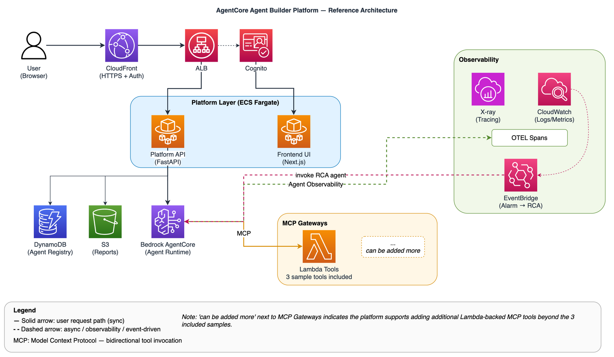

# AgentCore Agent Builder Platform Demo

> [AWS Bedrock AgentCore](https://aws.amazon.com/bedrock/agentcore/) 기반 엔터프라이즈 AI 에이전트 관리 플랫폼의 레퍼런스 아키텍처입니다.

[한국어](#개요) | [English](#overview)

---

## 개요

이 샘플은 운영 클라우드 환경에서 AI 에이전트를 **개발하지 않고 조립**해서 사용할 수 있는 플랫폼을 어떻게 구성하는지 보여줍니다. 한 명의 엔지니어가 자기 도구를 만드는 단계를 넘어, **10명 이상의 클라우드 운영 조직**이 에이전트를 자산으로 공유·운영하기 시작할 때 필요한 구조입니다.

**주요 기능**

- **AI 에이전트 생성/관리** — 웹 UI에서 에이전트 워크플로우를 시각적으로 설계하고 카드(Card) 단위로 등록
- **MCP 도구 연결** — Lambda 기반 Gateway를 통해 운영 도구를 재사용 가능한 부품으로 제공
- **실시간 관측성** — X-Ray 분산 트레이싱, CloudWatch 로그, OTEL 스팬으로 에이전트 호출 흐름 가시화
- **자동 인시던트 대응** — CloudWatch 알람 → EventBridge → RCA 에이전트 자동 실행 → S3 보고서 저장

## 아키텍처



> 다이어그램 소스: [`docs/images/architecture.drawio`](docs/images/architecture.drawio) (draw.io / diagrams.net)

## 빠른 시작

```bash
# 1. 클론
git clone https://github.com/aws-samples/sample-aws-kr-enterprise.git
cd ai-ml/agentcore-agent-builder-platform-demo

# 2. 환경변수 설정
export AWS_REGION=us-west-2
export ACCOUNT_ID=$(aws sts get-caller-identity --query Account --output text)

# 3. 전체 배포 (약 15분, custom domain 없이 CloudFront 기본 도메인 사용)
./scripts/deploy-all.sh
```

> `deploy-all.sh`가 완료되면 웹 UI에서 Agent 정의 → Deploy → Playground 테스트까지 가능합니다.

## 배포 단계 (deploy-all.sh)

| Phase | 내용 | 소요 시간 |
|-------|------|-----------|
| 1 | **Terraform Apply** — VPC, ECR, DynamoDB, ECS, CloudFront, CodeBuild 등 ~70 리소스 생성 | ~5분 |
| 2 | **Container Image Build** — CodeBuild로 4개 이미지 빌드 후 ECR push | ~5분 |
| 3 | **Seed Data** — DynamoDB에 에이전트 메타데이터, 게이트웨이 설정 시드 | ~10초 |
| 4 | **ECS Redeployment** — 새 이미지로 platform-api, frontend 서비스 재시작 | ~3분 |
| 5 | **AgentCore Agents** — AgentCore Runtime 등록 (선택, Preview API) | ~2분 |
| 6 | **MCP Gateways** — Lambda 기반 MCP Gateway 연결 (선택) | ~1분 |

### Agent Deploy 동작 원리

```
[Phase 2: CodeBuild] → ECR에 base-image push
                              ↓
[Phase 4: ECS 재배포] → platform-api에 BASE_IMAGE_URI 환경변수 주입
                              ↓
[웹 UI: Deploy Agent 클릭] → API가 BASE_IMAGE_URI로 AgentCore Runtime 생성
                              ↓
[AgentCore] → ECR에서 이미지 pull → Runtime READY → Playground 사용 가능
```

> **중요:** Phase 2(이미지 빌드)가 완료되어야 웹 UI의 "Deploy Agent" 기능이 정상 동작합니다.
> ECR에 이미지가 없으면 AgentCore가 이미지를 pull할 수 없어 배포에 실패합니다.

## 사전 준비물

- Bedrock AgentCore 사용 가능한 AWS 계정
- Terraform >= 1.5.0
- Docker
- Node.js >= 18
- AWS CLI v2
- (선택) custom domain을 사용하려면 ACM wildcard 인증서 + Route53 hosted zone

## 기술 스택

| 계층 | 기술 |
|------|------|
| Frontend | Next.js 14, Tailwind CSS |
| Backend API | FastAPI (Python) |
| Agent Runtime | Strands SDK on Bedrock AgentCore |
| MCP Tools | AWS Lambda (Python) |
| Compute | ECS Fargate |
| CDN/Auth | CloudFront + Cognito |
| Data | DynamoDB, S3 |
| Build | CodeBuild (x86 + arm64) |
| IaC | Terraform (8 modules) |
| Observability | X-Ray, CloudWatch, OTEL |

## 환경변수

| Variable | Required | 설명 |
|----------|----------|-------|
| `AWS_REGION` | Yes | AWS 리전 (e.g. us-west-2) |
| `ACCOUNT_ID` | Yes | 12자리 AWS Account ID |
| `DOMAIN_NAME` | No | Route53 hosted zone 도메인 (비우면 CloudFront 기본 도메인) |
| `PROJECT_PREFIX` | No | 리소스 prefix (default: aiops-v2-dev) |

## 배포되는 리소스

전체 `terraform apply` + 이미지 빌드 시 생성되는 주요 리소스:

| 모듈 | 리소스 | 수량 |
|------|--------|------|
| network | VPC, 4 Subnets, NAT GW, VPC Endpoints | ~15 |
| data | DynamoDB (2 tables), S3 bucket | 3 |
| auth | Cognito User Pool + Client | 2 |
| registry | ECR Repositories | 4 |
| iam | IAM Roles (ECS, AgentCore, Platform API, CodeBuild) | 4 |
| compute | ECS Cluster, 2 Services, ALB, EventBridge Rule | ~12 |
| cdn | CloudFront Distribution, VPC Origin | ~5 |
| build | CodeBuild Projects (x86, arm64), S3 source bucket | 4 |
| **Total** | | **~70** |

## 이미지 빌드

컨테이너 이미지는 CodeBuild를 통해 빌드됩니다:

| 이미지 | 아키텍처 | 용도 |
|--------|----------|------|
| `platform-api` | amd64 | ECS Fargate — FastAPI backend |
| `frontend` | amd64 | ECS Fargate — Next.js UI |
| `base-image` | arm64 | AgentCore Runtime — Strands agent |
| `report-image` | arm64 | AgentCore Runtime — Report generation |

```bash
# 이미지만 별도 빌드 (Terraform apply 이후)
./scripts/build-images.sh
```

## 폴더 구조

```
agentcore-agent-builder-platform-demo/
├── README.md
├── code/
│   ├── buildspec-x86.yml    # CodeBuild — amd64 images
│   ├── buildspec-arm64.yml  # CodeBuild — arm64 images
│   ├── control-plane/
│   │   ├── api/           # FastAPI — Platform API
│   │   └── ui/            # Next.js 14 — Platform UI
│   ├── agent-runtime/     # Strands SDK Base Image
│   └── tools/             # MCP Lambda Tool 샘플 3종
├── iac/
│   ├── modules/           # 8개 Terraform 모듈
│   │   ├── network/       # VPC, Subnets, NAT, VPC Endpoints
│   │   ├── data/          # DynamoDB, S3
│   │   ├── auth/          # Cognito
│   │   ├── registry/      # ECR
│   │   ├── iam/           # IAM Roles
│   │   ├── compute/       # ECS Fargate, ALB, EventBridge
│   │   ├── cdn/           # CloudFront, Route53
│   │   └── build/         # CodeBuild (x86 + arm64)
│   └── envs/dev/          # Root module (환경 설정)
└── scripts/
    ├── deploy-all.sh      # 한 번에 전체 배포
    ├── build-images.sh    # CodeBuild 이미지 빌드 실행
    ├── deploy-agents.sh   # AgentCore 에이전트 등록
    ├── deploy-gateways.sh # MCP Gateway 설정
    ├── seed-dynamodb.sh   # 초기 데이터 시드
    └── register-gateway-targets.py
```

## 정리 (리소스 삭제)

```bash
# 1. AgentCore Runtime 삭제 (수동 — API 호출)
# deploy-agents.sh에서 등록한 runtime을 삭제합니다
# (현재 AgentCore Preview에서는 콘솔 또는 CLI로 삭제)

# 2. 인프라 전체 삭제
cd iac/envs/dev
terraform destroy -auto-approve

# 3. (선택) ECR에 남은 이미지 삭제 확인
# terraform destroy 시 force_delete=true로 ECR 이미지도 함께 삭제됨
```

> ⚠️ **비용 주의**: NAT Gateway, ALB, ECS Fargate, CloudFront, VPC Endpoints는 시간당 과금됩니다.
> 데모 완료 후 반드시 `terraform destroy`를 실행하세요.

## 참고

- [AWS Bedrock AgentCore Documentation](https://docs.aws.amazon.com/bedrock/latest/userguide/agentcore.html)
- [Strands SDK](https://github.com/strands-agents/sdk-python)
- [Model Context Protocol (MCP)](https://modelcontextprotocol.io/)

---

## Overview

This sample demonstrates how to build a full-stack agent management platform that:

- **Creates & manages AI agents** through a web-based UI with visual workflow design
- **Connects agents to tools** via MCP (Model Context Protocol) Gateways backed by Lambda functions
- **Provides real-time observability** — traces, logs, and metrics for agent execution
- **Automates incident response** — CloudWatch Alarms trigger agent-driven RCA (Root Cause Analysis)

## Architecture


> Diagram source: [`docs/images/architecture.drawio`](docs/images/architecture.drawio) (draw.io / diagrams.net)

## Project Structure

```
agentcore-agent-builder-platform-demo/
├── README.md
├── code/
│   ├── buildspec-x86.yml    # CodeBuild — amd64 images
│   ├── buildspec-arm64.yml  # CodeBuild — arm64 images
│   ├── control-plane/
│   │   ├── api/           # FastAPI — Platform API
│   │   └── ui/            # Next.js 14 — Platform UI
│   ├── agent-runtime/     # Strands SDK Base Image
│   └── tools/             # 3 sample MCP Lambda tools
├── iac/
│   ├── modules/           # 8 Terraform modules
│   │   ├── network/       # VPC, Subnets, NAT, VPC Endpoints
│   │   ├── data/          # DynamoDB, S3
│   │   ├── auth/          # Cognito
│   │   ├── registry/      # ECR
│   │   ├── iam/           # IAM Roles
│   │   ├── compute/       # ECS Fargate, ALB, EventBridge
│   │   ├── cdn/           # CloudFront, Route53
│   │   └── build/         # CodeBuild (x86 + arm64)
│   └── envs/dev/          # Root module (environment config)
└── scripts/
    ├── deploy-all.sh      # One-shot full deployment
    ├── build-images.sh    # CodeBuild image build trigger
    ├── deploy-agents.sh   # AgentCore agent registration
    ├── deploy-gateways.sh # MCP Gateway setup
    ├── seed-dynamodb.sh   # Initial data seeding
    └── register-gateway-targets.py
```

## Prerequisites

- AWS Account with Bedrock AgentCore access
- Terraform >= 1.5.0
- Docker
- Node.js >= 18
- AWS CLI v2 configured
- (Optional) ACM wildcard certificate + Route53 hosted zone for custom domain

## Quick Start

```bash
# 1. Clone
git clone https://github.com/aws-samples/sample-aws-kr-enterprise.git
cd ai-ml/agentcore-agent-builder-platform-demo

# 2. Set required environment variables
export AWS_REGION=us-west-2
export ACCOUNT_ID=$(aws sts get-caller-identity --query Account --output text)

# 3. Deploy everything (uses CloudFront default domain — no custom domain needed)
./scripts/deploy-all.sh
```

> Once `deploy-all.sh` completes, you can define agents, deploy them, and test via the Playground — all from the web UI.

## Deployment Phases (deploy-all.sh)

| Phase | Description | Duration |
|-------|-------------|----------|
| 1 | **Terraform Apply** — Provisions ~70 resources (VPC, ECR, DynamoDB, ECS, CloudFront, CodeBuild) | ~5 min |
| 2 | **Container Image Build** — Builds 4 images via CodeBuild, pushes to ECR | ~5 min |
| 3 | **Seed Data** — Populates DynamoDB with agent metadata and gateway configs | ~10 sec |
| 4 | **ECS Redeployment** — Restarts platform-api and frontend with new images | ~3 min |
| 5 | **AgentCore Agents** — Registers agent runtimes (optional, Preview API) | ~2 min |
| 6 | **MCP Gateways** — Configures Lambda-backed MCP Gateways (optional) | ~1 min |

### How Agent Deploy Works

```
[Phase 2: CodeBuild] → Pushes base-image to ECR
                              ↓
[Phase 4: ECS Redeploy] → Injects BASE_IMAGE_URI env var into platform-api
                              ↓
[Web UI: Deploy Agent] → API calls AgentCore with BASE_IMAGE_URI
                              ↓
[AgentCore] → Pulls image from ECR → Runtime READY → Playground available
```

> **Important:** Phase 2 (image build) must complete for the web UI's "Deploy Agent" to work.
> If ECR is empty, AgentCore cannot pull the image and deployment fails.

## Environment Variables

| Variable | Required | Description |
|----------|----------|-------------|
| `AWS_REGION` | Yes | AWS region (e.g. us-west-2) |
| `ACCOUNT_ID` | Yes | 12-digit AWS Account ID |
| `DOMAIN_NAME` | No | Route53 hosted zone domain (empty = CloudFront default domain) |
| `PROJECT_PREFIX` | No | Resource prefix (default: aiops-v2-dev) |

## Key Features

### Agent Builder UI
- Visual agent workflow designer
- Real-time chat playground for testing agents
- Agent status monitoring dashboard

### MCP Gateway Integration
- 3 pre-built sample tools — extendable with additional Lambda-backed MCP tools
- Lambda-based tool execution
- Cross-account resource access support

### Observability
- X-Ray distributed tracing for agent invocations
- CloudWatch Logs with structured spans
- Real-time metrics dashboard

### Container Image Build
- CodeBuild-based multi-architecture builds (x86 for ECS, arm64 for AgentCore)
- Automated via `scripts/build-images.sh` after Terraform apply
- Builds 4 images: `platform-api`, `frontend`, `base-image`, `report-image`

### Automated Incident Response
- EventBridge rule captures CloudWatch Alarm state changes
- Automatically triggers incident RCA agent
- Generates structured reports saved to S3

## Cleanup

```bash
# 1. Delete AgentCore Runtimes (manual — API call)
# Remove runtimes registered by deploy-agents.sh
# (Use console or CLI during AgentCore Preview)

# 2. Destroy all infrastructure
cd iac/envs/dev
terraform destroy -auto-approve

# 3. (Optional) Verify ECR images are removed
# ECR repos have force_delete=true so images are removed with terraform destroy
```

> ⚠️ **Cost Warning**: NAT Gateway, ALB, ECS Fargate, CloudFront, and VPC Endpoints incur hourly charges.
> Always run `terraform destroy` after completing the demo.

## Security

See [CONTRIBUTING](../../CONTRIBUTING.md) for security issue reporting.

## License

This project is licensed under the MIT-0 License. See the [LICENSE](../../LICENSE) file.
