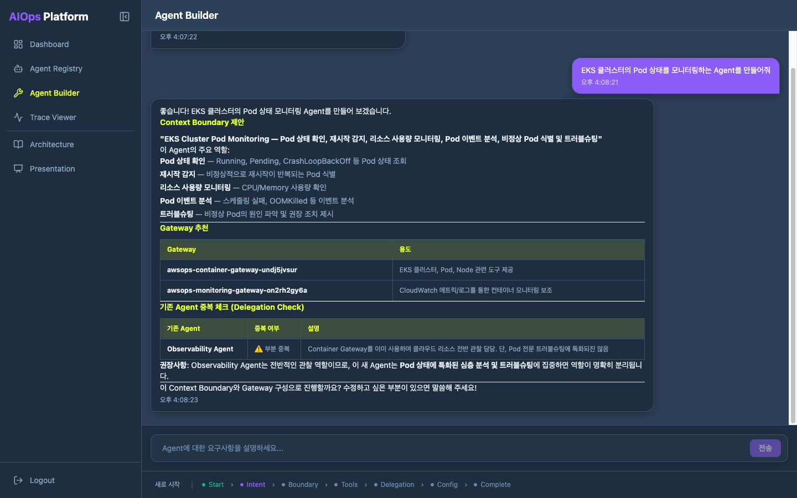
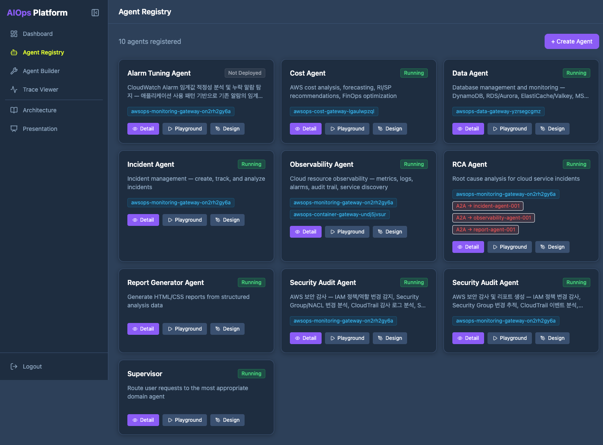
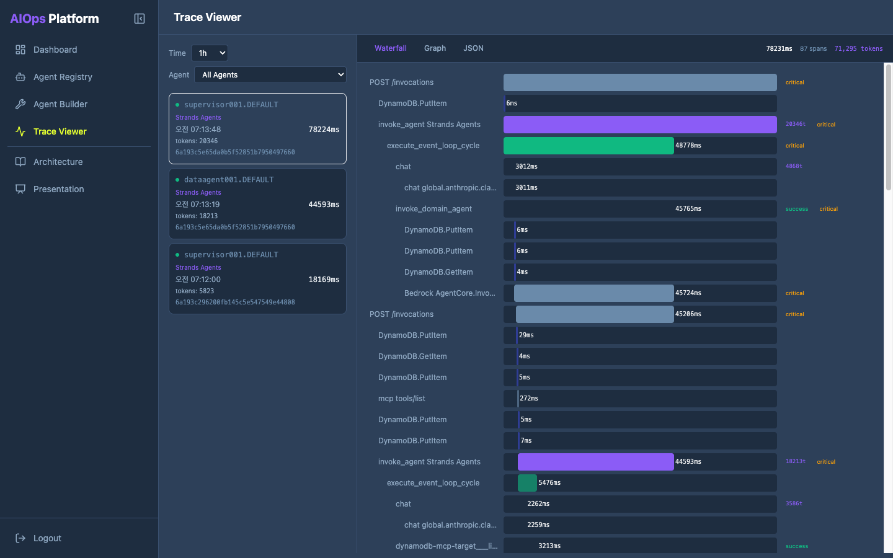

<!--
초안 상태: DRAFT (한국어 1차)
동기화 대상: part1-outline.md
이미지 경로는 게재 채널에 맞게 후처리. 단어수는 outline 트래커에서 관리.
-->

# AI 에이전트를 개발하지 않고 조립한다 — Amazon Bedrock AgentCore 기반 엔터프라이즈 에이전트 빌더 플랫폼 레퍼런스 아키텍처

## [S0] 들어가며: 에이전트를 한 명이 만들던 시대의 끝

지난 1년 동안 많은 엔지니어가 자기만의 AI 에이전트를 만들어 봤습니다. CloudWatch 지표를 조회하는 작은 도구, EKS 클러스터 상태를 점검하는 스크립트, 장애 로그를 요약하는 프롬프트. LLM과 몇 개의 도구를 엮으면 놀랍도록 빠르게 동작하는 에이전트가 나옵니다. 여기까지는 한 사람의 생산성 향상 이야기입니다.

문제는 그다음입니다. 10명, 20명이 일하는 클라우드 운영 조직에서 각자가 자기 에이전트를 만들기 시작하면 세 가지 벽에 부딪힙니다. 첫째, **중복 개발** — 옆 팀이 이미 만든 CloudWatch 조회 도구를 또 만듭니다. 둘째, **신뢰 불가** — 누가 만든 에이전트가 무슨 도구를 어떤 권한으로 호출하는지 아무도 전체 그림을 모릅니다. 셋째, **거버넌스 부재** — 에이전트가 운영 환경에서 무엇을 했는지 추적할 방법이 없어 프로덕션에 올리기가 두렵습니다.

개인의 도구가 조직의 자산이 되려면, 에이전트를 **매번 새로 개발하는** 방식에서 **이미 검증된 부품을 조립하는** 방식으로 넘어가야 합니다. 이 글은 Amazon Bedrock AgentCore를 기반으로 그런 플랫폼을 어떻게 구성하는지를 보여주는 레퍼런스 아키텍처를 소개합니다. 전체 코드는 [aws-samples](https://github.com/aws-samples/sample-aws-kr-enterprise)에 공개되어 있으며, `deploy-all.sh` 한 번으로 약 15분 만에 배포됩니다.

## [S1] 왜 '개발'이 아니라 '조립'인가

"조립한다"는 말은 비유가 아니라 이 플랫폼의 동작 방식 그 자체입니다. 새 에이전트가 필요할 때 엔지니어가 코드를 작성하지 않습니다. 대신 웹 UI에서 **세 가지 부품을 조립**합니다.

- **Context Boundary** — 이 에이전트가 무엇을 책임지는지, 어디까지가 그 일의 경계인지. 시스템 프롬프트와 역할 정의에 해당합니다.
- **Gateway** — 에이전트가 사용할 도구 묶음. CloudWatch, EKS, cross-account 조회 같은 운영 도구를 Gateway 단위로 연결합니다(도구는 Lambda로 구현되고, Gateway가 이를 MCP 표준 인터페이스로 노출합니다).
- **Delegation** — 복잡한 작업을 하위 도메인 에이전트에게 위임하는 구조. Supervisor 에이전트가 작업을 쪼개 전문 에이전트에게 넘깁니다.

조립이 끝나면 에이전트는 코드 파일이 아니라 **카드(Card)** 라는 자산으로 등록됩니다. 카드는 조직 누구나 조회하고, Playground에서 테스트하고, 다시 설계 화면으로 들어가 수정할 수 있는 공유 단위입니다. 한 사람이 만든 "EKS 헬스체크 에이전트"가 조직 레지스트리에 카드로 올라가면, 옆 팀은 그것을 다시 만들지 않고 그대로 가져다 쓰거나 변형합니다.



이 전환의 핵심은 *재사용 가능한 경계*입니다. 코드로 만든 에이전트는 만든 사람만 고칠 수 있지만, 부품으로 조립한 에이전트는 누구나 같은 부품을 다시 꺼내 쓸 수 있습니다. 개발이 아니라 조립이기 때문에 가능한 일입니다.

## [S2] 전체 아키텍처

플랫폼은 네 개의 레이어로 구성됩니다.


- **Presentation Layer** — CloudFront + Next.js 14 UI. CloudFront는 VPC Origin을 통해 프라이빗 서브넷의 내부 ALB로 직접 연결되며, 트래픽은 AWS 백본을 벗어나지 않습니다. 인증은 Cognito 기반 JWT를 애플리케이션 레벨에서 검증합니다.
- **Control Plane** — ECS Fargate 위의 FastAPI. 에이전트 카드의 CRUD, AgentCore 연동, 세션 관리, 관측성 쿼리를 담당합니다. 조립한 에이전트를 실제 런타임으로 만들어내는 오케스트레이터입니다.
- **Agent Runtime** — Bedrock AgentCore 위에서 동작하는 Strands SDK 컨테이너. 서버를 직접 관리하지 않는 관리형 런타임으로, "Deploy" 버튼을 누르면 AgentCore가 ECR에서 이미지를 받아 실행합니다.
- **Tool Layer** — boto3/AWS CLI 기반 코드를 담은 Lambda 함수들을 AgentCore Gateway로 묶은 계층. Gateway가 이 도구들을 MCP(Model Context Protocol) 엔드포인트로 노출하면, 에이전트는 표준화된 방식으로 운영 도구를 발견하고 호출합니다.

데이터는 DynamoDB(에이전트 메타데이터·인시던트)와 S3(보고서)에 저장되고, CloudWatch 알람은 EventBridge를 거쳐 자동 인시던트 대응 흐름으로 이어집니다. 전체 인프라는 Terraform 8개 모듈로 코드화되어 있어 한 번의 `terraform apply`로 약 70개 리소스가 생성됩니다.

## [S3] 조립의 핵심 ① — Agent Builder

Agent Builder는 "개발하지 않고 조립한다"가 실제로 일어나는 화면입니다. 엔지니어는 자연어로 요구사항을 적습니다.

> "Pod 상태와 노드 용량을 모니터링하고 실패한 배포를 보고하는 EKS 클러스터 헬스체크 에이전트를 만들어 줘."

그러면 Builder가 이 요구를 세 부품으로 분해해 조립안을 제시합니다. **Context Boundary**로 "EKS 클러스터 상태 점검"이라는 역할과 책임 경계를 잡고, 필요한 **Gateway**(EKS·CloudWatch MCP 도구 묶음)를 선택하고, 작업이 복잡하면 하위 에이전트로의 **Delegation** 구조를 제안합니다. 엔지니어는 생성된 시스템 프롬프트, 도구 선택, 모델 선택을 검토하고 조정합니다.



확정하면 에이전트는 카드로 레지스트리에 등록됩니다. 카드를 클릭하면 바로 Playground에서 테스트하거나 Design 화면으로 들어가 부품을 다시 조립할 수 있습니다. 조직 단위로 쌓인 카드는 "우리 조직이 보유한 운영 에이전트 목록" 그 자체가 됩니다.

여기서 실제 배포가 흥미롭습니다. "Deploy" 버튼을 누르면 Control Plane API가 미리 빌드된 베이스 이미지 URI로 AgentCore Runtime을 생성하고, AgentCore가 ECR에서 이미지를 받아 런타임을 READY 상태로 만듭니다. 엔지니어는 컨테이너도, 서버도 다루지 않습니다. 부품을 고르고 버튼을 누르는 것이 전부입니다.

> **시리즈 노트** — 현재 이 카드 레지스트리는 플랫폼이 자체 구현한 것입니다. AgentCore에 추가되는 **관리형 Agent Registry**로 이 부분을 대체할 수 있으며, 다음 편에서 다룹니다.

## [S4] 조립의 핵심 ② — Gateway로 도구를 표준화하고 재사용한다

조립이 성립하려면 조립할 부품이 표준화되어 있어야 합니다. 이 플랫폼은 그 표준화를 **구현과 인터페이스를 분리**하는 방식으로 풉니다.

먼저 **구현(implementation)** — 도구의 실체는 AWS Lambda 함수입니다. Lambda 안에서 boto3(또는 AWS CLI) 기반 코드가 실제 운영 작업을 수행합니다. CloudWatch 지표를 조회하고, EKS 클러스터 상태를 점검하고, STS AssumeRole로 교차 계정 리소스에 접근합니다. 이 레퍼런스에는 `aws_cloudwatch_mcp`(지표·알람·로그 조회), `aws_eks_mcp`(클러스터·Pod 상태), `cross_account`(교차 계정 접근 헬퍼) 세 가지 샘플이 포함되어 있고, 같은 패턴으로 도구를 계속 확장할 수 있습니다.

다음으로 **인터페이스** — 이 Lambda들은 **AgentCore Gateway에 target으로 등록**됩니다. 그리고 Gateway는 **MCP(Model Context Protocol) 프로토콜로 생성**됩니다. 여기가 핵심입니다. MCP는 에이전트가 도구를 발견(discover)하고 호출하는 방식을 표준화한 오픈 프로토콜로, "AI를 위한 USB-C"에 비유됩니다. AgentCore Gateway는 Lambda·API·OpenAPI 스펙을 **MCP 호환 도구로 변환(translate)**하고, 여러 도구를 **하나의 MCP 엔드포인트로 합성(compose)**해 에이전트에게 제공합니다. 즉 도구의 *구현*은 Lambda 위 boto3/CLI 코드이지만, 에이전트가 보는 *인터페이스*는 일관된 MCP입니다. 이 데모도 이 패턴을 그대로 따라, 도구를 도메인별로 묶은 여러 Gateway(network·container·data·monitoring·cost 등)를 MCP 엔드포인트로 노출합니다.

이 분리가 앞 절의 "중복 개발" 문제를 직접 해소합니다. CloudWatch 조회 도구를 한 번 Lambda로 만들어 Gateway에 등록하면, EKS 헬스체크 에이전트도, 인시던트 RCA 에이전트도, 비용 분석 에이전트도 모두 같은 MCP 도구를 재사용합니다. 도구를 만든 사람과 쓰는 사람이 분리되고, 도구는 조직 공용 부품이 됩니다. 새 도구가 필요하면 Lambda 하나를 추가해 Gateway에 등록하는 것으로 조직 전체가 그 도구를 MCP로 쓸 수 있게 됩니다 — 도구는 늘어날수록 가치가 커지는 공유 자산입니다. AgentCore Gateway의 시맨틱 검색은 도구가 수백 개로 늘어도 에이전트가 작업 맥락에 맞는 도구를 골라 쓰게 해줍니다.

## [S5] 조립한 것을 신뢰하기 — 관측성과 Harness

부품으로 빠르게 조립할 수 있다는 것만으로는 프로덕션에 올릴 수 없습니다. "이 에이전트가 운영 환경에서 실제로 무엇을 했는가"를 추적할 수 없다면, 조립의 편리함은 오히려 통제 불능의 위험이 됩니다. 그래서 이 플랫폼은 조립한 에이전트를 **신뢰할 수 있게 만드는 관측성 계층(Harness)** 을 함께 제공합니다.



모든 에이전트 호출은 OTEL 스팬과 X-Ray 분산 트레이싱으로 기록됩니다. Trace Viewer는 이를 워터폴 형태로 보여줍니다 — Supervisor 에이전트가 요청을 받아 Domain 에이전트에게 위임하고, Domain 에이전트가 MCP Tool을 호출하는 전 과정이 하나의 스팬 트리로 펼쳐집니다. 각 스팬은 하나의 도구 호출 또는 LLM 추론에 대응하며, 지연 시간과 토큰 사용량까지 분해해서 볼 수 있습니다.

이 가시성이 조립을 안전하게 만듭니다. 에이전트가 예상과 다르게 동작하면 어느 스팬에서 무슨 도구를 어떤 인자로 호출했는지 그대로 들여다볼 수 있습니다. CloudWatch 알람이 EventBridge를 통해 RCA 에이전트를 자동 실행하는 무인 인시던트 대응 흐름도, 모든 단계가 트레이스로 남기 때문에 사후에 검증할 수 있습니다. 조립의 속도와 운영의 신뢰가 양립합니다.

> **시리즈 노트** — 현재 이 관측성 계층은 플랫폼이 자체 구현한 것입니다. AgentCore에 추가되는 **관리형 Harness**로 이 부분을 대체하거나 단순화할 수 있으며, 다음 편에서 다룹니다.

## [S6] 배포 — 15분 one-shot

레퍼런스 아키텍처는 읽는 것으로 끝나면 의미가 절반입니다. 이 플랫폼은 환경변수 두 개만 설정하면 `deploy-all.sh` 한 번으로 전체가 배포됩니다. custom domain 없이 CloudFront 기본 도메인을 쓰므로 사전 준비물이 사실상 없습니다.

```bash
export AWS_REGION=us-west-2
export ACCOUNT_ID=$(aws sts get-caller-identity --query Account --output text)
./scripts/deploy-all.sh
```

배포는 6단계로 진행됩니다.

| Phase | 내용 | 소요 |
|-------|------|------|
| 1 | Terraform Apply — VPC·ECR·DynamoDB·ECS·CloudFront 등 ~70 리소스 | ~5분 |
| 2 | Container Image Build — CodeBuild로 4개 이미지 빌드 후 ECR push | ~5분 |
| 3 | Seed Data — DynamoDB에 에이전트·게이트웨이 메타데이터 시드 | ~10초 |
| 4 | ECS Redeployment — 새 이미지로 서비스 재시작 | ~3분 |
| 5 | AgentCore Agents — Runtime 등록 (선택) | ~2분 |
| 6 | MCP Gateways — Lambda 기반 Gateway 연결 (선택) | ~1분 |

인프라는 Terraform 8개 모듈(network·data·auth·registry·iam·compute·cdn·build)로 분리되어 있어 각 계층을 독립적으로 이해하고 변경할 수 있습니다. 데모가 끝나면 `terraform destroy` 한 번으로 정리됩니다. NAT Gateway·ALB·Fargate·CloudFront는 시간당 과금되므로 반드시 정리하세요.

## [S7] 마무리

개인의 생산성 도구였던 AI 에이전트가 조직의 공유 자산이 되는 길목에는 세 가지 전환이 있습니다. 에이전트를 **개발하지 않고 조립**하고(Agent Builder), 도구를 **표준 부품으로 재사용**하고(MCP Gateway), 조립한 것을 **추적 가능하게 만들어 신뢰**합니다(관측성/Harness). Amazon Bedrock AgentCore는 이 셋을 떠받치는 관리형 기반을 제공하고, 이 레퍼런스 아키텍처는 그 위에 엔터프라이즈 플랫폼을 어떻게 올리는지 보여줍니다.

전체 코드는 [aws-samples GitHub](https://github.com/aws-samples/sample-aws-kr-enterprise)에서 확인할 수 있습니다. 클론한 뒤 `deploy-all.sh`를 실행하면 15분 안에 직접 에이전트를 조립하고 Playground에서 테스트해 볼 수 있습니다.

이번 편이 보여준 것은 **현재의 빌딩블록으로 직접 조립한** 버전입니다. 카드 레지스트리도, 관측성 Harness도 플랫폼이 자체 구현했습니다. 다음 편에서는 AgentCore에 새로 추가된 **관리형 Agent Registry와 관리형 Harness**로 이 자체 구현 구성요소들을 어떻게 대체하고 단순화하는지, before/after로 살펴보겠습니다.

---

## 참고

- [Amazon Bedrock AgentCore](https://aws.amazon.com/bedrock/agentcore/)
- [Strands SDK](https://github.com/strands-agents/sdk-python)
- [Model Context Protocol (MCP)](https://modelcontextprotocol.io/)
- [레퍼런스 아키텍처 소스 코드](https://github.com/aws-samples/sample-aws-kr-enterprise)
