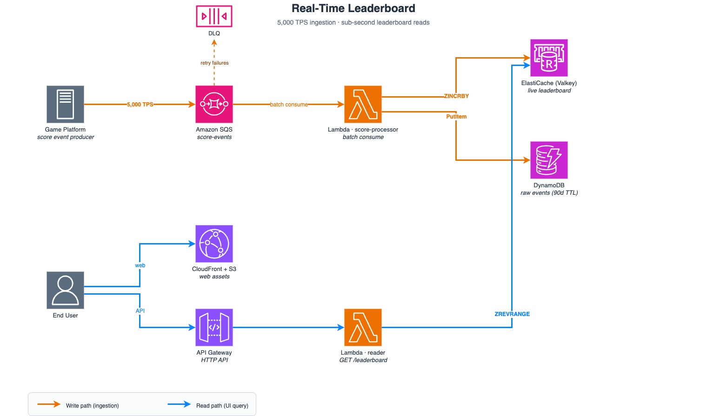

# Real-Time Leaderboard on AWS

> Reference architecture for near-real-time gaming leaderboards at scale — serverless ingestion, Valkey-backed ranking, and live observability.


## Overview

Gaming platforms need to update, rank, and display scores for hundreds of thousands of concurrent players with sub-second perceived latency. The classic approaches — polling a relational database or serializing writes through a single service — break down well below the traffic a popular title generates.

This repository is a working demo and reference architecture that solves the problem on AWS using managed services only. It ingests score events through Amazon SQS, processes them with AWS Lambda in batches, maintains an authoritative ranking in Amazon ElastiCache for Valkey using `ZINCRBY` / `ZREVRANGE` (wire-compatible with Redis 7), and persists the raw event stream to Amazon DynamoDB for audit and replay. A static demo page (S3 + CloudFront) drives synthetic load through AWS Step Functions and visualizes the live leaderboard alongside CloudWatch metrics.

It targets **5,000 TPS sustained ingestion**, **p95 write latency under 2 seconds**, **p95 read latency under 100 ms**, and **zero message loss**, all in a single AWS account (`us-east-1`) with no cross-account boundaries.

## Architecture



**Write path.** Score event producers publish to an SQS Standard queue (`score-events`). A processor Lambda consumes messages via Event Source Mapping with **batch size 200 and a 2-second batching window**, applies a DynamoDB conditional-write idempotency check keyed on event ID, then issues `ZINCRBY` to the per-game Valkey sorted set. Failures land in a DLQ after `maxReceiveCount=5`.

**Read path.** Amazon CloudFront + S3 serves the demo SPA. API Gateway (HTTP API) fronts a reader Lambda that calls `ZREVRANGE` for top-N queries and `ZREVRANK` for a user's rank. The same endpoint also exposes an aggregated `/admin/metrics` view that combines CloudWatch `GetMetricData` with a live SQS `GetQueueAttributes` probe so the dashboard reflects queue depth within ~1 second instead of CloudWatch's 1–2 minute aggregation window.

**Demo surface.** The SPA polls the read API on a 1-second interval and the metrics endpoint on a 10-second interval, rendering the leaderboard and five KPI cards (SQS depth, Lambda invocations, Lambda errors, Valkey engine CPU, end-to-end latency). Buttons trigger Step Functions executions that fan out to 25 load-generator Lambdas at 200 TPS each, producing 5,000 TPS sustained load.

See [`docs/ARCHITECTURE.md`](docs/ARCHITECTURE.md) and the ADRs under [`docs/adr/`](docs/adr/) for detailed decisions and tradeoffs.

## Features

- Sub-2-second end-to-end leaderboard updates at 5,000 TPS sustained
- Per-game independent leaderboards, permanent score accumulation
- Idempotent ingestion — safe against SQS at-least-once redelivery
- Built-in load generator with predefined sustain scenarios (5K × 1 min, 5K × 5 min)
- Live metrics dashboard with sub-second SQS depth feedback
- DLQ + replay path via DynamoDB raw events (`ZSET` rebuildable from source of truth)
- Full teardown path for cost control after demos

## Durability & High Availability

ElastiCache for Valkey is configured for production-grade durability, not as a volatile cache:

- **Multi-AZ replication.** Primary (`-001`) + Replica (`-002`) on `cache.r7g.large`, deployed across two Availability Zones with automatic failover enabled.
- **Engine-level persistence.** Valkey 8.0 inherits Redis 7's **Multi-Part AOF** (safe rewrite under crash) and **decoupled replication backlog** (short network partitions recover via incremental sync, not full resync).
- **Faster replication.** Valkey 8.0's async I/O threading reduces the window between a Primary write and Replica acknowledgement.
- **Automated snapshots.** Daily backups to S3 with configurable retention (1–35 days).
- **Source of truth.** DynamoDB retains every raw event for 90 days (TTL); the Valkey ZSET can be rebuilt deterministically from DDB at any time — double safety.

## Tech Stack

| Layer | Service |
|---|---|
| Ingestion queue | Amazon SQS (Standard) + DLQ, `VisibilityTimeout=360s` |
| Compute | AWS Lambda (processor, reader, load-generator, load-gen-trigger) — Python 3.12 |
| Ranking store | Amazon ElastiCache for Valkey 8.0 — `cache.r7g.large` × 2 (Primary + Replica), Multi-AZ, TLS + AUTH |
| Event log | Amazon DynamoDB (on-demand, TTL 90d) |
| API | Amazon API Gateway (HTTP API) |
| Static hosting | Amazon S3 + Amazon CloudFront (OAC), default CloudFront domain |
| Load orchestration | AWS Step Functions (Map state, max concurrency 25) |
| Observability | Amazon CloudWatch (metrics, logs, dashboard) + AWS Lambda Powertools (EMF high-resolution metrics) |
| IaC | AWS CDK (Python) — nested stacks |
| Region | `us-east-1` |

## Repository Structure

```
real-time-leaderboard/
├── README.md                  This file
├── LICENSE                    MIT license
├── CONTRIBUTING.md            Contributor guide
├── Makefile                   Build / deploy / teardown targets
├── docs/
│   ├── ARCHITECTURE.md        System design and component detail
│   ├── PLAN.md                Project plan, phases, milestones
│   ├── RUNBOOK.md             Deploy, operate, troubleshoot, tear down
│   ├── STRUCTURE.md           Code layout reference
│   ├── adr/                   Architecture Decision Records
│   ├── design/                UI / UX design specs
│   └── qa/                    QA reports and screenshots
├── diagrams/                  Architecture diagram (jpg)
├── infra/                     AWS CDK stacks (Network / Data / Ingest / Api / LoadGen / Web)
├── app/
│   ├── lambdas/               Lambda handlers (processor, reader, load_generator, load_gen_trigger)
│   ├── shared/                Shared helpers (Valkey client, DDB helpers)
│   └── scripts/               Exit-criteria verification scripts
└── web/                       Demo page SPA (vanilla TypeScript + Vite)
```

## Prerequisites

- An authorized AWS account with permissions to create SQS, Lambda, ElastiCache, DynamoDB, API Gateway, S3, CloudFront, Step Functions, VPC, and IAM resources in `us-east-1`
- AWS CLI v2 configured with a deployable profile
- AWS CDK ≥ 2.140 (Python) — CDK bootstrap required once per account/region
- Python 3.12 (Lambda runtime and CDK app language)
- Node.js 20 and a modern browser for the demo web build

## Quick Start

```bash
# 1. Install dependencies
python3.12 -m venv .venv && source .venv/bin/activate
pip install -r requirements-dev.txt

# 2. Build the demo SPA
cd web && npm install && npm run build && cd ..

# 3. Deploy the stack (bootstrap first if needed: cdk bootstrap)
cd infra && cdk deploy --all --require-approval never

# 4. Open the CloudFront URL printed in outputs, then click the load-generator button
```

Tear down with `cdk destroy --all` when finished. See [`docs/RUNBOOK.md`](docs/RUNBOOK.md) for operational procedures.

## Performance Tuning Notes

The processor Lambda is tuned based on measured per-record cost (~12 ms for DDB conditional write + Valkey `ZINCRBY`):

| Parameter | Value | Rationale |
|---|---|---|
| Memory | 1024 MB | Full vCPU + 2× network bandwidth for this I/O-bound workload |
| Timeout | 60 s | ~25× margin over typical 2.5 s invocation time |
| Reserved concurrency | 100 | ~1.6× the 62 concurrent executions needed to drain 5K TPS |
| ESM batch size | 200 | 20× fewer invocations vs default 10, safe without pipelining |
| ESM batch window | 2 s | Lets batches fill at low TPS without adding latency at 5K TPS |
| SQS visibility timeout | 360 s | Lambda timeout × 6 (AWS recommendation) |

Theoretical throughput: 100 concurrency × 200 batch / ~2.45 s invocation ≈ **8,160 events/s** — 1.6× the 5K TPS target.

## Documentation

| Document | Purpose |
|---|---|
| [`docs/ARCHITECTURE.md`](docs/ARCHITECTURE.md) | System design, data flow, component responsibilities |
| [`docs/adr/`](docs/adr/) | Architecture Decision Records with context and tradeoffs |
| [`docs/PLAN.md`](docs/PLAN.md) | Phases, milestones, success criteria, risks |
| [`docs/RUNBOOK.md`](docs/RUNBOOK.md) | Deploy, operate, troubleshoot, tear down |
| [`docs/qa/`](docs/qa/) | QA reports and verification evidence |
| [`CONTRIBUTING.md`](CONTRIBUTING.md) | Commit style, branch naming, PR checklist |

## Contributing

Issues and pull requests are welcome. Please read [`CONTRIBUTING.md`](CONTRIBUTING.md) before opening a PR — it covers branch naming, commit style, documentation expectations, and the review checklist.

## License

Released under the MIT License. See [`LICENSE`](LICENSE) for the full text.
